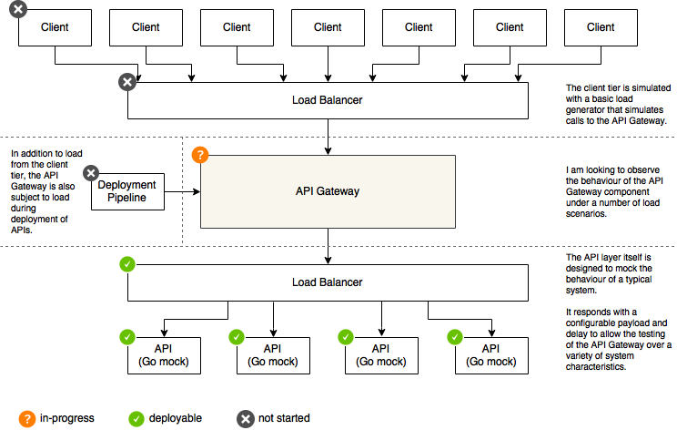

# load-sink
 This is a simple HTTP(S) endpoint that can be used to act as a sink for load 
 testing. I built it primarily because I'm looking to test a number of 
 components within a typical API deplyment architecture and needed a 
 configurable endpoint that would allow me to simulate the behaviour of 
 various back-end systems.

 

The diagram above shows four components of interest:

 - **the client** - the intent is to simulate client load with a load generator
 - **the deployment pipeline** - the intent is to simulate deployment load with mock deployments
 - **the API gateway** - this is the component of interest, how will it hold up
 - **the API** - this is the sink for the load, used to mock back-end system behaviour

## The API

### Building the Container

[](https://travis-ci.org/billglover/load-sink)

To build the API and package it in a Docker container run the following.

```
CGO_ENABLED=0 GOOS=linux go build -a -tags netgo -ldflags '-w'
docker build -t load-sink .
```

The latest container is available on the Docker Hub registry: [billglover/load-sink/](https://hub.docker.com/r/billglover/load-sink/)

If you have docker installed locally you can run the container and test that 
everything is working.

```
docker run -p 8080:8080 -p 8081:8081 -d load-sink
```

Query the main API: 

```
curl -i -XGET http://localhost:8080
```
```
HTTP/1.1 200 OK
Content-Type: text/plain
Date: Fri, 23 Dec 2016 21:48:04 GMT
Content-Length: 11

hello world
```

Query the health API: 

```
curl -i -XGET http://localhost:8081
```
```
HTTP/1.1 200 OK
Content-Type: text/plain
Date: Fri, 23 Dec 2016 21:48:30 GMT
Content-Length: 13

healthy world
```

## The Deployment Pipeline

Mocking the deployment pipeline is still on the wishlist.

## Load Generation

Load generation is still on the wishlist.
